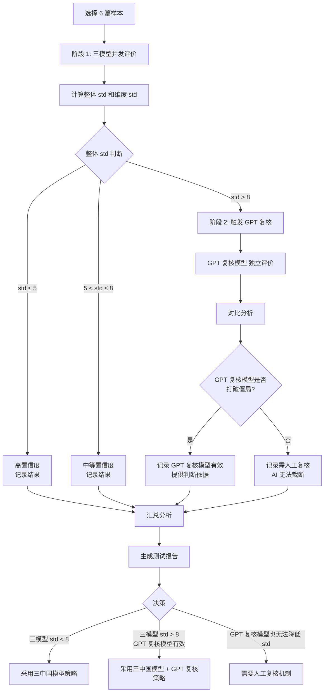

# v0.14 多模型验证测试计划

**文档版本**：v1.0  
**创建日期**：2026-05-08  
**测试目标**：验证 v0.14 评审规程在"中国自主知识体系"框架下的多模型稳定性

---

## 1. 测试背景

### 1.1 为什么需要重新测试

1. **v0.14 核心变化**：
   - 增加"中国自主知识体系"概念（中国问题中心性、中国实践解释、外部理论转化）
   - 这不是简单的维度调整，而是评价哲学的转变
   - 之前基于 v0.8 的测试结论不能直接迁移

2. **模型覆盖不足**：
   - 之前未测试 DeepSeek v4 pro
   - 中国模型可能在理解"中国自主知识体系"概念上更有优势

3. **评审规程变化**：
   - v0.14 增加了项目口径预检、自主知识体系信号校验等新流程
   - 需要验证 AI 是否真有能力完成这些任务

### 1.2 测试假设

**假设 1**：中国模型在理解"中国自主知识体系"相关概念时，可能比国外模型更稳定  
**假设 2**：多模型分歧主要来自模型系统性差异，而非规则不够细  
**假设 3**：理论建构型、文化阐释型论文的分歧会比传统法学论证型更大

---

## 2. 测试方案设计

### 2.1 阶段 1：三中国模型并发基线测试

**目标**：评估三个中国模型的稳定性和一致性

**模型组合**：
- GLM-5.1（智谱 AI）
- Qwen3.6-Plus（阿里通义千问）
- DeepSeek-v4-pro（深度求索）

**供应商**：DashScope 百炼（已验证 JSON 输出稳定）

**框架配置**：
- 框架文件：`configs/frameworks/law-v2.42-20260507.yaml`
- Temperature：0.3（降低随机性）
- 评分维度：6 个维度全部评估
- 前置检查：包含（验证 AI 预检能力）

**样本选择**：从 `raw/holdout-test/` 和 `raw/validation/` 中选择 **6 篇**

| 样本 | 类型 | 中国自主知识体系信号 | 测试目的 |
|------|------|---------------------|----------|
| 数字法学的理论表达_马长山.pdf | 理论建构型 | 强 | 测试理论型论文的分歧 + 中国模型优势 |
| 善终、凶死与杀人偿命_尚海明.pdf | 文化阐释型 | 强 | 测试文化阐释型的分歧 + 中国模型优势 |
| 股东会与董事会分权制度研究_许可.pdf | 传统法学论证型 | 中 | 基线稳定性测试 |
| 法典化时代的刑法典修订_周光权.pdf | 制度立法型 | 中 | 测试制度型论文的分歧 |
| 迈向自主法学知识体系的比较法研究范式_宋亚辉.pdf | 理论建构型 | 强 | 直接涉及"自主知识体系"概念 |
| 法秩序统一性原理之建构_雷磊.pdf | 理论建构型 | 中 | 测试理论建构的稳定性 |

**样本分布**：
- 传统法学论证型：1 篇
- 理论建构型：3 篇
- 文化阐释型：1 篇
- 制度立法型：1 篇
- "中国自主知识体系"信号强：3 篇
- "中国自主知识体系"信号中：3 篇

### 2.2 阶段 2：分歧分析 + GPT 复核介入

**分歧判断标准**：
- **高置信度**：std ≤ 5 分 → 无需介入
- **中等置信度**：5 < std ≤ 8 分 → 记录但暂不介入
- **低置信度**：8 < std ≤ 12 分 → 触发 GPT 复核
- **关键分歧**：std > 12 分 → 强制 GPT 复核

**GPT 复核介入方式**（推荐方案 B）：
- **定位**：分歧触发的复核模型，不是第四个并发模型
- **触发条件**：
  - 整体 std > 8 分
  - 单维度 std > 12 分
  - 理论型/文化阐释型论文（预期高分歧）
- **输出**：
  - GPT 复核模型的独立评分
  - 与三模型均值的偏差分析
  - 是否"打破僵局"的判断

**GPT 复核模型不参与均值计算**，仅作为"专家复核前的 AI 复核"

---

## 3. 测试指标

### 3.1 核心指标

**1. 整体稳定性**：
- 三模型平均 std（期望 < 8 分）
- 高置信度比例（std ≤ 5 分的论文占比，期望 > 50%）
- 中等置信度比例（5 < std ≤ 8 分）
- 低置信度比例（8 < std ≤ 12 分）
- 关键分歧比例（std > 12 分）

**2. 维度级稳定性**：
- 六个维度各自的平均 std
- 识别哪些维度分歧最大
- 是否需要对高分歧维度做概念操作化

**3. "中国自主知识体系"信号识别一致性**：
- 三模型对"中国问题中心性"的识别是否一致
- 三模型对"中国实践解释"的识别是否一致
- 三模型对"外部理论转化"的识别是否一致
- 信号强度与评分的相关性

**4. 论文类型与分歧的关系**：
- 传统法学论证型的平均 std
- 理论建构型的平均 std
- 文化阐释型的平均 std
- 制度立法型的平均 std

**5. GPT 复核介入效果**（如果触发）：
- GPT 复核模型 与三模型均值的偏差
- GPT 复核模型是否能"打破僵局"（即：GPT 复核模型的评分是否接近某个中国模型，从而提供判断依据）
- GPT 复核模型的评分偏向（偏高/偏低/居中）

### 3.2 AI 能力边界验证

**前置检查能力**：
- 三模型对"明显不适格"的识别一致性
- 三模型对"边界论文"的识别一致性
- 前置检查的误报率（false positive）

**自主知识体系信号识别能力**：
- 三模型对信号强度的判断一致性
- 信号识别与人工判断的对比（需要人工标注）

---

## 4. 测试流程



---

## 5. 预期产出

### 5.1 测试报告

**文件名**：`docs/evaluation/v0.14-multi-model-test-report-20260508.md`

**内容结构**：

1. **执行摘要**
   - 测试结论（三模型策略是否可行）
   - 关键发现（3-5 条）
   - 策略建议

2. **模型稳定性分析**
   - 三模型各自的 std 分布
   - 整体平均 std
   - 高/中/低/关键分歧论文占比
   - 与 v0.8 测试结果的对比

3. **维度级分析**
   - 六个维度的平均 std
   - 哪些维度分歧最大
   - 是否需要概念操作化

4. **"中国自主知识体系"信号识别分析**
   - 三模型对新增概念的理解一致性
   - 中国模型是否确实比 GPT 更擅长识别这些信号
   - 信号强度与评分的相关性

5. **论文类型与分歧的关系**
   - 不同类型论文的平均 std
   - 验证假设 3（理论型/文化阐释型分歧更大）

6. **GPT 复核介入效果分析**（如果触发）
   - GPT 复核模型在多少案例中"打破僵局"
   - GPT 复核模型的评分偏向
   - GPT 复核模型 作为复核模型的有效性

7. **AI 能力边界验证**
   - 前置检查的准确性
   - 自主知识体系信号识别的准确性
   - AI 不适合承担的任务清单

8. **策略建议**
   - 是否采用三中国模型策略
   - 是否需要引入 GPT 复核模型 作为常驻复核模型
   - 哪些类型论文需要强制人工复核
   - v0.15 规程改进建议

### 5.2 原始数据

**文件格式**：JSON

**文件命名**：`results/v0.14-test-{paper_name}-{timestamp}.json`

**数据结构**：
```json
{
  "framework": "configs/frameworks/law-v2.42-20260507.yaml",
  "framework_version": "2.42.0",
  "paper": "raw/xxx.pdf",
  "models": ["glm-5.1", "qwen3.6-plus", "deepseek-v4-pro"],
  "precheck": {
    "glm-5.1": {...},
    "qwen3.6-plus": {...},
    "deepseek-v4-pro": {...}
  },
  "dimensions": {
    "problem_originality": {
      "scores": {"glm-5.1": 85, "qwen3.6-plus": 82, "deepseek-v4-pro": 88},
      "mean": 85.0,
      "std": 3.0,
      "confidence": "high",
      "raw_outputs": {...}
    },
    ...
  },
  "overall": {
    "avg_std": 5.2,
    "max_std": 8.1,
    "weighted_total": 78.5,
    "high_confidence_pct": 66.7
  },
  "gpt_review": {
    "triggered": true,
    "reason": "std > 8 on analytical_framework",
    "scores": {...},
    "analysis": "..."
  }
}
```

---

## 6. 实施步骤

### 6.1 准备阶段（预计 0.5 天）

- [x] 创建测试计划文档
- [ ] 准备测试脚本（`scripts/run_v0.14_multi_model_test.py`）
- [ ] 验证 DashScope 百炼调用三个模型是否稳定
- [ ] 验证 Zenmux 调用 GPT 复核模型是否稳定
- [ ] 准备样本文件清单

### 6.2 小规模测试（预计 0.5 天）

- [ ] 选择 2 篇样本（1 篇传统型 + 1 篇理论型）
- [ ] 运行三模型并发测试
- [ ] 检查输出格式是否符合预期
- [ ] 检查 v0.14 框架的 prompt 是否需要调整
- [ ] 如果有问题，修复后重新测试

### 6.3 完整测试（预计 1 天）

- [ ] 运行 6 篇样本的三模型并发测试
- [ ] 收集所有原始数据
- [ ] 对 std > 8 的论文触发 GPT 复核
- [ ] 汇总所有测试结果

### 6.4 分析与报告（预计 1 天）

- [ ] 计算所有测试指标
- [ ] 生成可视化图表（std 分布、维度对比、论文类型对比）
- [ ] 撰写测试报告
- [ ] 提出策略建议

### 6.5 决策（预计 0.5 天）

- [ ] 与项目团队讨论测试结果
- [ ] 确定最终策略（三模型 / 三模型+GPT 复核模型 / 需人工复核）
- [ ] 规划 v0.15 规程改进方向

**总预计时间**：3.5 天

---

## 7. 风险与应对

### 7.1 风险 1：样本已污染

**描述**：选择的样本之前参与过 v0.8 或其他版本的调参

**影响**：测试结果不能代表真实泛化能力

**应对**：
- 优先选择 `raw/validation/` 中的样本（最少被使用）
- 如果必须使用 `raw/holdout-test/` 的样本，标记为"已污染"
- 最终验证时不能再用这些样本

### 7.2 风险 2：模型 API 不稳定

**描述**：DashScope 百炼或 Zenmux 的 API 调用失败或超时

**影响**：测试无法完成或数据不完整

**应对**：
- 测试脚本增加重试机制（最多 3 次）
- 记录所有 API 调用失败的情况
- 如果某个模型失败率过高，考虑替换

### 7.3 风险 3：v0.14 框架配置问题

**描述**：v0.14 规程对应的框架配置文件（law-v2.42）可能不完全匹配 v0.14 的要求

**影响**：测试结果不能真实反映 v0.14 规程的效果

**应对**：
- 小规模测试阶段检查 prompt 是否包含"中国自主知识体系"相关内容
- 如果不匹配，需要更新框架配置文件
- 记录所有配置调整

### 7.4 风险 4：GPT 复核模型 成本过高

**描述**：如果大部分论文都触发 GPT 复核，成本可能超出预算

**影响**：无法完成完整测试

**应对**：
- 优先测试三模型，只在必要时触发 GPT 复核模型
- 如果成本过高，可以只对部分高分歧论文触发 GPT 复核模型
- 记录成本数据，用于后续决策

---

## 8. 成功标准

### 8.1 测试成功标准

- [ ] 完成 6 篇样本的三模型并发测试
- [ ] 所有测试数据完整且格式正确
- [ ] 生成完整的测试报告
- [ ] 提出明确的策略建议

### 8.2 策略可行性标准

**方案 A：三中国模型策略可行**
- 三模型平均 std < 8 分
- 高置信度比例 > 50%
- 关键分歧比例 < 20%

**方案 B：三中国模型 + GPT 复核策略可行**
- 三模型平均 std 在 8-12 分之间
- GPT 复核模型能在 > 60% 的分歧案例中"打破僵局"
- GPT 复核模型触发率 < 30%（成本可控）

**方案 C：需要人工复核机制**
- 三模型平均 std > 12 分
- GPT 复核模型也无法降低 std
- 说明 AI 无法处理这类论文，必须人工复核

---

## 9. 后续工作

### 9.1 如果三模型策略可行

1. 在更大样本集上验证（10-20 篇）
2. 制定三模型评审的标准操作流程（SOP）
3. 开发自动化评审工具
4. 规划 v0.15 规程（补充流程治理规则）

### 9.2 如果需要 GPT 复核

1. 明确 GPT 复核模型的触发条件和复核流程
2. 评估成本和效率
3. 开发 GPT 复核的自动化工具
4. 规划 v0.15 规程（增加 AI 复核层）

### 9.3 如果需要人工复核

1. 明确哪些类型论文必须人工复核
2. 设计人工复核的工作流程
3. 评估人工复核的工作量
4. 规划 v0.15 规程（明确 AI 能力边界）

---

## 10. 附录

### 10.1 样本文件清单

| 文件名 | 路径 | 类型 | 中国自主知识体系信号 |
|--------|------|------|---------------------|
| 数字法学的理论表达_马长山.pdf | raw/holdout-test/ | 理论建构型 | 强 |
| 善终、凶死与杀人偿命_尚海明.pdf | raw/holdout-test/ | 文化阐释型 | 强 |
| 股东会与董事会分权制度研究_许可.pdf | raw/holdout-test/ | 传统法学论证型 | 中 |
| 法典化时代的刑法典修订_周光权.pdf | raw/holdout-test/ | 制度立法型 | 中 |
| 迈向自主法学知识体系的比较法研究范式_宋亚辉.pdf | raw/validation/ | 理论建构型 | 强 |
| 法秩序统一性原理之建构_雷磊.pdf | raw/validation/ | 理论建构型 | 中 |

### 10.2 测试脚本使用说明

详见 `scripts/run_v0.14_multi_model_test.py` 的文档字符串。

### 10.3 参考文档

- `docs/evaluation/law-ai-assisted-review-rules-v0.14-expert-edition.md`：v0.14 评审规程
- `docs/evaluation/law-ai-assisted-review-rules-v0.14-review-notes-20260508.md`：GPT 对 v0.14 的评价
- `docs/evaluation/std-analysis-summary-20260423.md`：v0.8 标准差分析总结
- `docs/evaluation/concept-operationalization-v1.0.md`：概念操作化定义

---

**文档状态**：待执行  
**下一步**：准备测试脚本和样本文件
